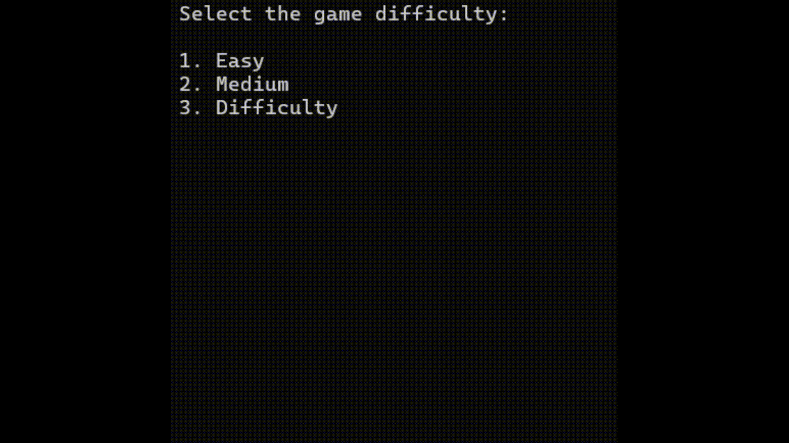

# Snake Game in C

This is a **Snake Game** implemented in C. It uses structured programming, dynamic memory allocation, and data structures like arrays and linked concepts to create a classic snake game. The game includes customizable difficulty levels and features smooth snake movement, wall wrapping, and fruit collection mechanics.



## 🐍 Features
- **Snake Movement**: Control the snake using the keyboard (`W`, `A`, `S`, `D`) for directional input.
- **Fruit Consumption**: Eating fruits (`*`) makes the snake grow and increases the challenge.
- **Difficulty Levels**: Select from Easy, Medium, or Hard, which adjust the board size.
- **Wall Wrapping**: The snake reappears on the opposite side when hitting the wall.
- **Win and Loss Conditions**:
  - **Win**: The player wins when the snake fills the entire board.
  - **Lose**: The game ends if the snake collides with itself.

## 🎮 How to Play
1. **Choose Difficulty**:  
   - 1: Easy
   - 2: Medium
   - 3: Hard

2. **Controls**:
   - `W`: Move up
   - `A`: Move left
   - `S`: Move down
   - `D`: Move right

3. **Objective**:
   - Collect all the fruits (`*`) without crashing into your own body.

## 🛠️ How to Run
1. **Requirements**:
   - A C compiler (e.g., GCC, Clang, or MinGW).
   - A terminal to execute the compiled program.

2. **Instructions**:
   - Compile the program:
     ```bash
     gcc snake_game.c -o snake_game
     ```
   - Run the program:
     ```bash
     ./snake_game
     ```

3. **For Windows**:
   - The program uses `<conio.h>` for keyboard input, which is compatible with Windows systems.

## 💻 Programming Concepts Used
This project demonstrates several important programming concepts, including:

### 1. **Dynamic Memory Allocation**
   - The `Table` and `Snake` structures dynamically allocate memory for the board and snake's body using `malloc()` and `free()`. This allows flexibility in board size and snake growth during gameplay.

### 2. **Structured Programming**
   - The game is modularized into multiple functions for better readability and maintainability. For example:
     - `initialize_*` functions handle the setup of game components.
     - `verify_*` functions check game logic, like collisions and fruit consumption.

### 3. **Enums for State Management**
   - Enumerations like `directions`, `gameStatus`, and `gameDifficulty` simplify the management of the snake's movement, game state, and difficulty levels, making the code more readable and less error-prone.

### 4. **Use of Structs**
   - Structures are used to group related data, such as:
     - `Table`: Represents the game board.
     - `Snake`: Tracks the snake's head, body, size, and movement direction.
     - `Fruit`: Handles the position and sprite of the fruit.
     - `Game`: Manages overall game state and links other components.

### 5. **Game Logic**
   - The game uses efficient logic for:
     - Collision detection with walls and the snake's body.
     - Wrapping the snake when it crosses the board boundaries.
     - Determining win or loss conditions based on the snake's size and position.

### 6. **Keyboard Input Handling**
   - The `_kbhit()` and `_getch()` functions (from `<conio.h>`) are used to capture user input without requiring the Enter key, enabling real-time movement of the snake.

### 7. **ANSI Escape Codes**
   - Escape codes like `\e[1;1H\e[2J` are used to clear the terminal screen, creating a smooth visual update for the game board.

## 📂 Code Overview
The project consists of the following key components:

- **Initialization Functions**:
  - `initialize_table`, `initialize_snake`, `initialize_fruit`, `initialize_game`: Set up the game board, snake, and fruit.
- **Game Logic Functions**:
  - `move_snake`, `verify_wall_collision`, `verify_self_collision`, `verify_fruit_eaten`, `verify_win`, `verify_keyboard`: Handle game mechanics.
- **Drawing Function**:
  - `draw_sprites`: Updates the board with the current positions of the snake and fruit.
- **Memory Management**:
  - `free_table` and `free_snake`: Free dynamically allocated memory to prevent memory leaks.

## 📜 License
This project is open-source and released under the MIT License. Feel free to use, modify, and share the code.

---

Enjoy playing the Snake Game! 🐍
